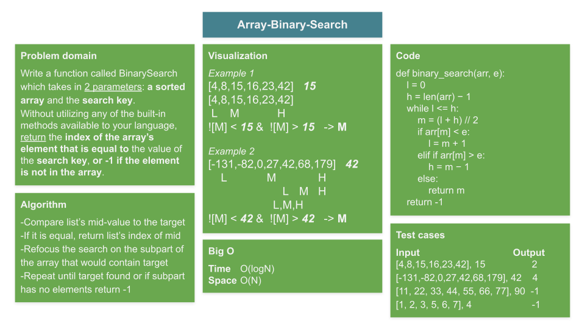

# Array Binary Search

## Problem statement

Write a function called BinarySearch which takes in 2 parameters: a sorted array and the search key. Without utilizing any of the built-in methods available to your language, return the index of the array’s element that is equal to the value of the search key, or -1 if the element is not in the array.

**NOTE**: This challenge is whiteboard only.

## Whiteboard

## Approach & Efficiency
Binary search is a well-established O(logN) algorithm.  I guess it's roots are in the common sense apporach of narrowing the search space by spliting it in half.

### Big O: O(logN) time and O(N) space

---