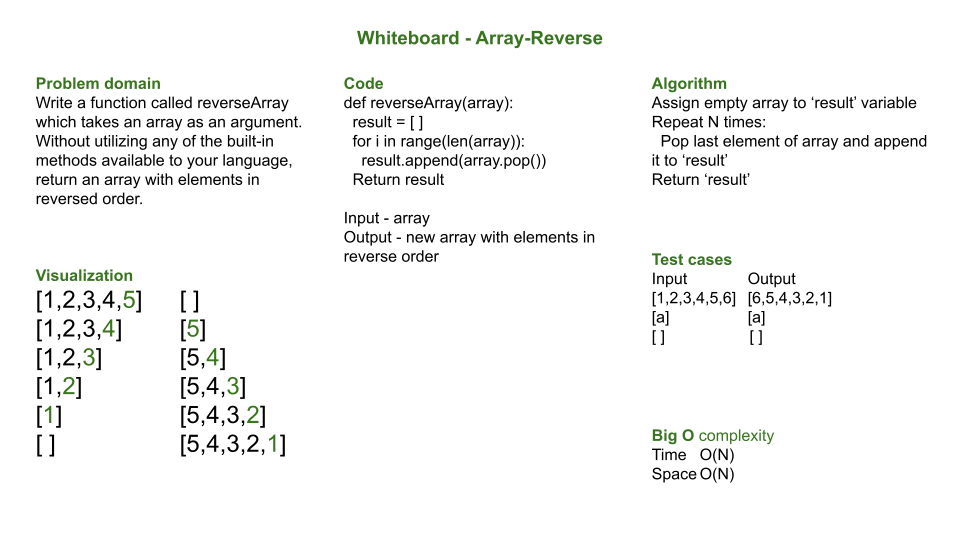

# ArrayReverse

## Problem statement

Write a function called reverseArray which takes an array as an argument. Without utilizing any of the built-in methods available to your language, return an array with elements in reversed order.

**NOTE**: This challenge is whiteboard only
Write out code as part of your whiteboard process, but don’t worry about creating external program files.
Your final whiteboard should look like this [example layout](https://codefellows.github.io/common_curriculum/data_structures_and_algorithms/Whiteboard_Workflow.html).

## Approach and efficiency

The apporach is to keep the process simple.  The simplest thing that came to mind is to keep time and space complexity at O(N).  Successively taking the last element of the input array and appending it to the result array meet these conditions.

