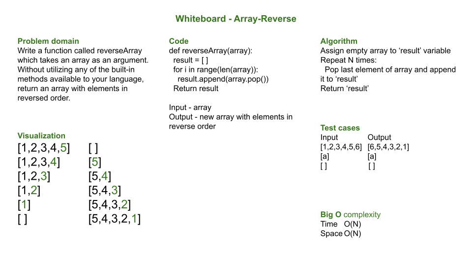

# ArrayReverse

## Problem statement

Write a function called reverseArray which takes an array as an argument. Without utilizing any of the built-in methods available to your language, return an array with elements in reversed order.

**NOTE**: This challenge is whiteboard only
Write out code as part of your whiteboard process, but don’t worry about creating external program files.
Your final whiteboard should look like this [example layout](https://codefellows.github.io/common_curriculum/data_structures_and_algorithms/Whiteboard_Workflow.html).

## Approach and efficiency

The apporach is to keep the process simple.  The simplest thing that came to mind is to keep time and space complexity at O(N).  Successively taking the last element of the input array and appending it to the result array meet these conditions.

### Whiteboard process summary

1. State the **problem domain** as clearly and concisely as possible.  Seek clarification as needed.
2. Draw a **visualization** of the problem.  It is very helpful to confirm understanding and outline potential solutions.
3. Outline the **algorithm**.  Begin with the input and work toward the output.  At a minimum, state all key steps.
4. Analyze the space and time efficiency of the algorithm; express it in **Big O** notation.
5. Outline the algorithm in **pseudocode**.  Follow these appropriate guidelines.
6. Write the algorithm in correct **code**.
7. **Test**. First walk through to make sure your solution works and is efficient.  Then, perform or describe a variety of tests, including standard input and edge cases.

### A note on Pseudocode
There are guidelines regarding proper structure of pseudocode.  In summary, pseudocode is:

- Language agnostic
- Lightweight and flexible
- Written:
  - without colons, semicolons, curly braces
  - with backwards arrows to set a value, indentation to specify scope, equal sign for comparison
- Specific with keywords DECLARE, OUTPUT and RETURN

[Pseudocode guidelines](https://codefellows.github.io/common_curriculum/data_structures_and_algorithms/Pseudocode)

---
