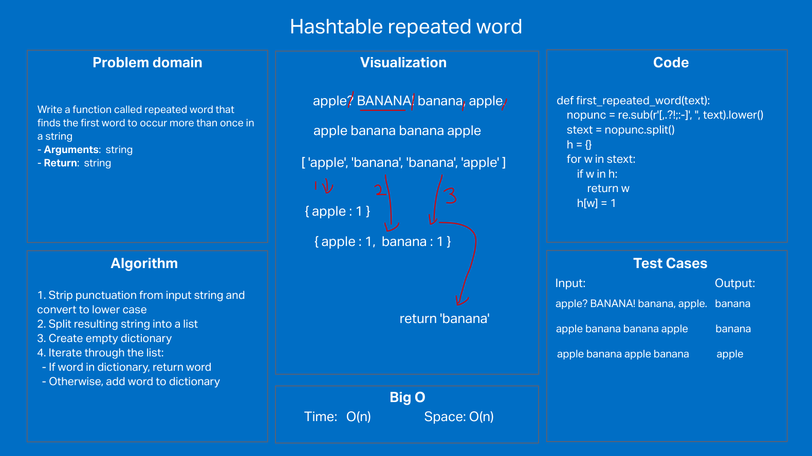

# Challenge Summary

Write a function called repeated word that finds the first word to occur more than once in a string.
Arguments: string
Return: string

## Whiteboard Process

## Approach & Efficiency

1. Strip punctuation from input string and convert to lower case
2. Split resulting string into a list
3. Create empty dictionary
4. Iterate through the list:
  - If word in dictionary, return word
  - Otherwise, add word to dictionary

#### Efficiency

Time O(n), space O(n)

## Solution
To run, call `first_repeated_word(string)`

Passes all required and custom tests:

- blank
- no_repeat
- a_a
- a_b_a
- a_b_a_b
- a_b_b_a
- ignore_case
- ignore_case_flipped
- punctuation
- punctuation_joins

- sample1 "Once upon a time, there was a brave princess who..."
- sample2 "It was a queer, sultry summer, the summer they electrocuted the Rosenbergs, and I didn’t know what I was doing in New York..."
- sample3
    """
    It was the best of times, it was the worst of times, it was the age of wisdom, 
    it was the age of foolishness, it was the epoch of belief, it was the epoch 
    of incredulity, it was the season of Light, it was the season of Darkness, 
    it was the spring of hope, it was the winter of despair, we had everything 
    before us, we had nothing before us, we were all going direct to Heaven, 
    we were all going direct the other way – in short, the period was so far 
    like the present period, that some of its noisiest authorities insisted 
    on its being received, for good or for evil, in the superlative degree 
    of comparison only..."""
