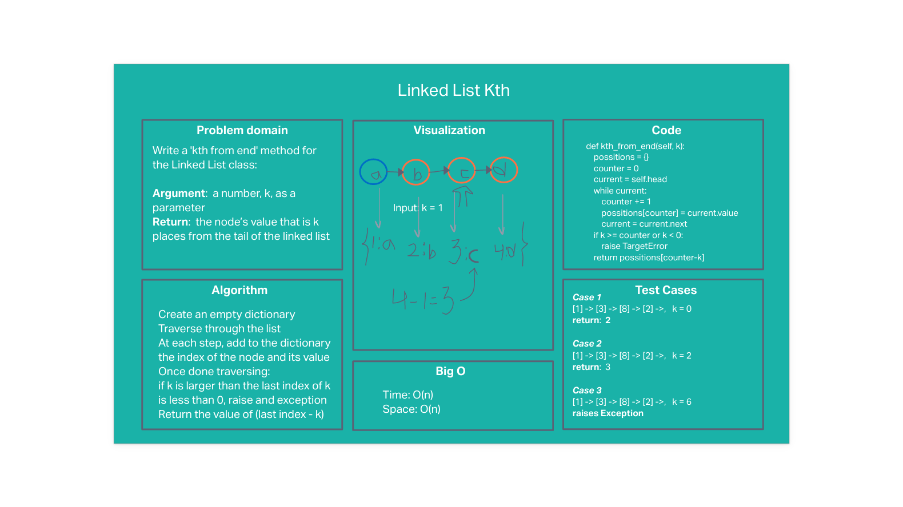

# Linked List Kth

## Problem statement

Write a 'kth from end' method for the Linked List class:

Argument:  a number, k, as a parameter
Return:  the node’s value that is k places from the tail of the linked list

## Whiteboard

## Approach & Efficiency
#### Approach
- Create and empty dictionary to store indices and values
- Traverse through the list adding the index and the value
- If k is out of range, raise an exception
- Return the value corresponding to (last index - k)

#### Efficiency: O(N) time and O(N) space

## Solution
The approach passes all tests:
- k is zero
- k is one
- k is two
- k is out of range -raises an exception
- k is not a possitive integer -raises an exception
- list is size one

A more efficient solution (like traversing two variables) would result in better space complexity (O(1)).

---