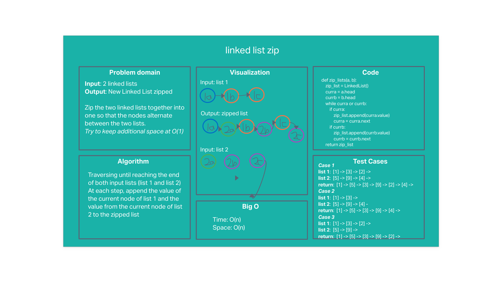

# Linked list zip

## Problem statement

Write a function called zip lists
Input: 2 linked lists
Output: New Linked List, zipped as noted below
Zip the two linked lists together into one so that the nodes alternate between the two lists and return a reference to the the zipped list.
Try and keep additional space down to O(1)

## Whiteboard

## Approach & Efficiency
#### Approach
- Create an empty linked list, which will become the zipped list
- Traverse until reaching the end of both input lists (list 1 and list 2)
- At each step, append the value of the current node of list 1 and the value from the current node of list 2 to the zipped list

#### Efficiency: O(N) time and O(N) space

## Solution
The approach passes all tests:
- Input lists of same length
- Input lists of differet lengths
- Either input list empty
- Both input lists empty

However, this solution has O(n) space complexity instead of the desired O(1).

To achieve O(1), instead of creating a new list and appending the values of each node to this list, we would change the pointers of each node.

---

[Back to table of contents](../../README.md)
