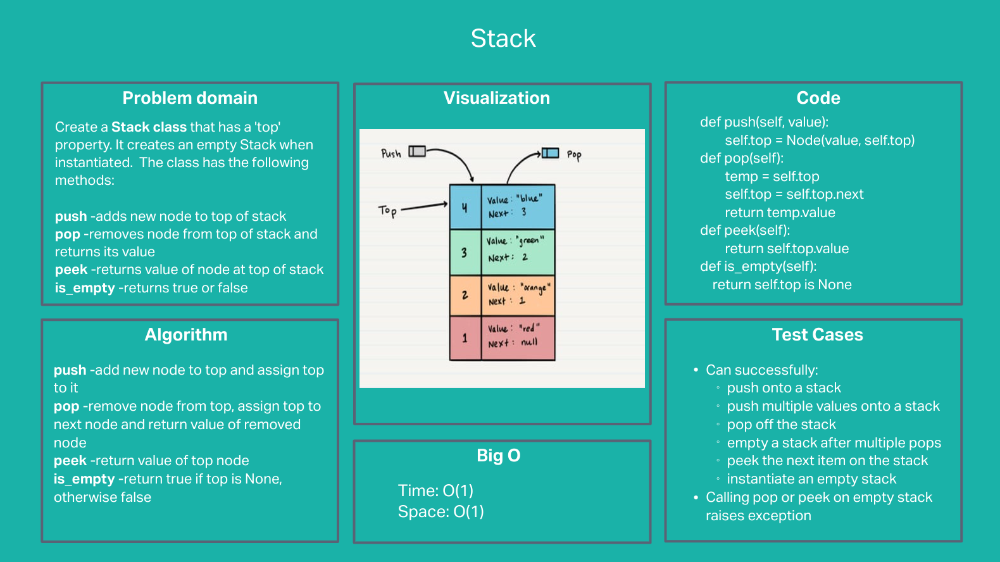
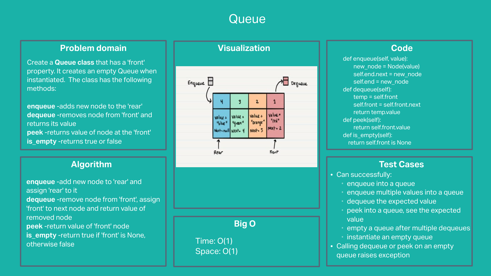

# Stacks and Queues

## Problem statement

Using a Linked List as the underlying data storage mechanism, implement a Stack and a Queue

#### Stack
Create a Stack class that has a 'top' property. It creates an empty Stack when instantiated.  The class has the following methods:

**push**
- Arguments: value
- Adds a new node with that value to the top of the stack in O(1) time

**pop**
- Arguments: none
- Return: value of node at the top of the stack
- Removes the node from the top of the stack
- Raises exception when called on empty stack

**peek**
- Arguments: none
- Return: value of node at the top of the stack
- Raises exception when called on empty stack

**is empty**
- Arguments: none
- Return: Boolean indicating whether or not the stack is empty

#### Queue
Create a Queue class that has a front property. It creates an empty Queue when instantiated.  The class has the following methods:

**enqueue**
- Arguments: value
- Adds a new node with that value to the back of the queue in O(1) time

**dequeue**
- Arguments: none
- Return: value from node at the front of the queue
- Removes the node from the front of the queue
- Raises exception when called on empty queue

**peek**
- Arguments: none
- Return:vValue of node at the front of the queue
- Raises exception when called on empty stack

**is empty**
- Arguments: none
- Return: Boolean indicating whether or not the queue is empty

## Whiteboard

## Approach & Efficiency
#### Approach
The approach is simple because each class gives us ready access to its only relevant nodes.  In the Stack case, all operations have to do with the 'top' node.  For Queues, it's either the front or the end node.  All we need to do is perform simple manipulations on these noodes.

#### Efficiency: O(1) time and O(1) space
All stack and queue operations are performed with O(1) time and O(1) space.  That's probably why stacks and queues are so popular to hold temporary data.

## Solution
Passes all tests.
Stack can successfully:
-  push onto a stack
-  push multiple values onto a stack
-  pop off the stack
-  empty a stack after multiple pops
-  peek the next item on the stack
-  instantiate an empty stack
Calling pop or peek on empty stack raises exception

Queue can successfully:
-  enqueue into a queue
-  enqueue multiple values into a queue
-  dequeue out of a queue the expected value
-  peek into a queue, seeing the expected value
-  empty a queue after multiple dequeues
-  instantiate an empty queue
Calling dequeue or peek on empty queue raises exception

---