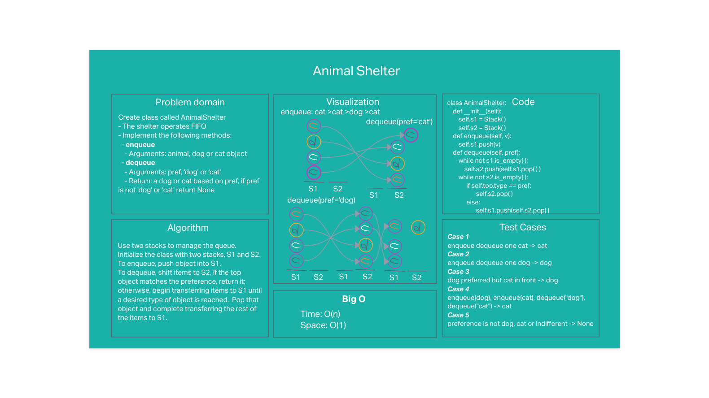

# Stack queue animal shelter

## Problem statement

Create class called AnimalShelter.
- The shelter operates FIFO
- Implement the following methods:
  - **enqueue**
    - Arguments: animal (a dog or cat object)
  - **dequeue**
    - Arguments: pref ('dog' or 'cat')
    - Return: a dog or cat based on pref, if pref is not 'dog' or 'cat' return None
    - Stretch goal: ff a cat or dog isn’t preferred, return whichever has been in the shelter the longest

## Whiteboard

## Approach & Efficiency
#### Approach
Use two stacks to manage the queue.
Initialize the class with two stacks, S1 and S2.

To enqueue, push object into S1.

To dequeue, shift items to S2, if the top object matches the preference, return it; otherwise, begin transferring items to S1 until a desired type of object is reached.  Pop that object and complete transferring the rest of the items to S1.

#### Efficiency: O(N) time and O(1) space

An implementation of two parallel queues, one for dogs and one for cats, would be more efficient.  It would have O(1) time and space performance.  However, absent some form of time-stamp and a method to look it up, it would to dequeue the animal that has been in the shelter the longest if the user did not enter a preference.

## Solution
The approach passes all tests:
- enqueue dequeue one cat
- enqueue dequeue one dog
- dog preferred but cat in front
- enqueue(dog), enqueue(cat), dequeue("dog"), dequeue("cat")
- preference is not dog, cat or indifferent

---

[Back to table of contents](../../README.md)
