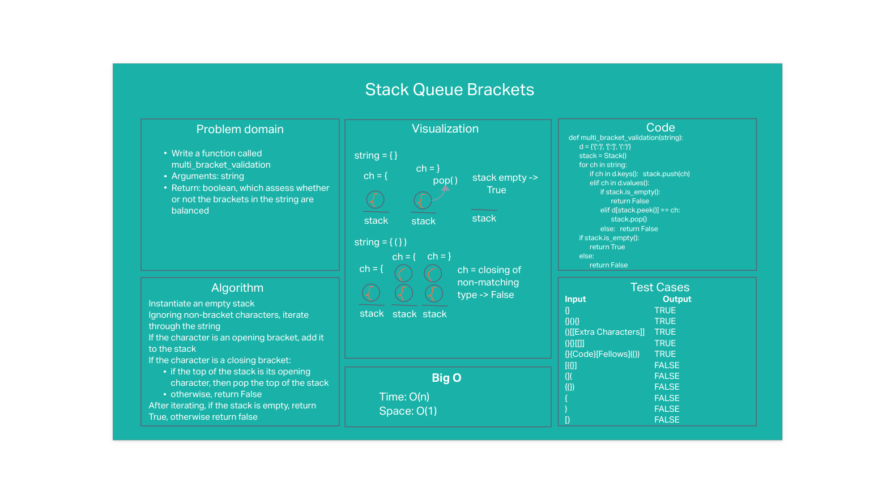

# Stack-queue pseudo

## Problem statement

Write a function called multi_bracket_validation
Arguments: string
Return: boolean, which representing whether or not the brackets in the string are balanced

## Whiteboard

## Approach & Efficiency
#### Approach
- Use a stack to temporarily store some of the bracket characters in the string
- Iterate through the string
  - if character is an opening bracket, push it into the stack
  - if character is a closing character and matches the type of opening character at the top of the stack, then pop the top.  Otherwise, if it does not match, then return False
- Once iteration is complete, if the stack is empty return True, otherwise False.

#### Efficiency: O(N) time and O(1) space

## Solution
This solution passes all required tests in addition to custom tests, including:
**Input**	                  **Output**
- {}	                  TRUE
- {}(){}	              TRUE
- ()[[Extra Characters]]TRUE
- (){}[[]]	            TRUE
- {}{Code}[Fellows](())	TRUE
- [({}]	                FALSE
- (](	                  FALSE
- {(})	                FALSE
- {                     FALSE
- )                     FALSE
- [}                    FALSE

---

[Back to table of contents](../../README.md)
