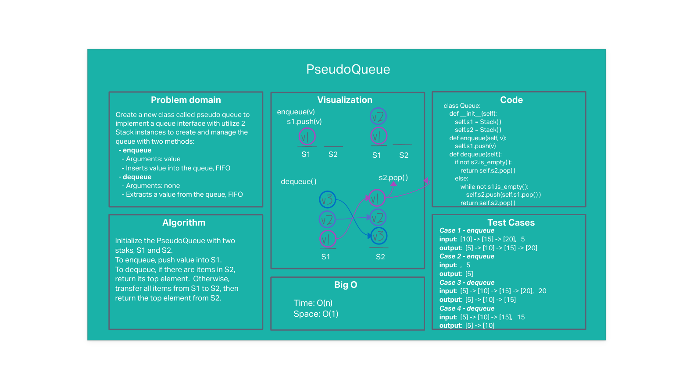

# Stack-queue pseudo

## Problem statement

Create a new class called pseudo queue.
- Do not use an existing Queue.
- Instead, this PseudoQueue class will implement our standard queue interface with two methods:
  - **enqueue**
    - Arguments: value
    - Inserts value into the PseudoQueue, using a first-in, first-out approach
  - **dequeue**
    - Arguments: none
    - Extracts a value from the PseudoQueue, using a first-in, first-out approach
- Internally, utilize 2 Stack instances to create and manage the queue

## Whiteboard

## Approach & Efficiency
#### Approach
- Use 2 stacks, s1 and s2 to emulate a queue
- Enqueue into s1 using its 'push' method
- Dequeue from s2 using its 'pop' method
- Transfer from s1 to s2 using pop followed by push
  - Only transfer from s1 to s2 when s2 is empty

#### Efficiency: O(N) time and O(1) space

While the approach works, it is less efficient than a pure linke list queue implementation, which has O(1) time and space performance.

## Solution
The approach passes all tests:
- enqueue one, then dequeue
- enqueue two, then dequeue two
- enqueue dequeue enqueue dequeue

---

[Back to table of contents](../../README.md)
