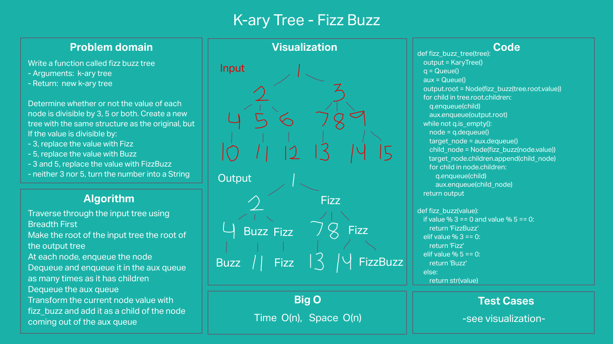

# K-ary tree fizz buzz

## Problem statement

Write a function called fizz buzz tree
- Arguments: k-ary tree
- Return: new k-ary tree

Determine whether or not the value of each node is divisible by 3, 5 or both. Create a new tree with the same structure as the original, but If the value is divisible:

- 3, replace the value with “Fizz”
- 5, replace the value with “Buzz”
- 3 and 5, replace the value with “FizzBuzz”
- neither 3 nor 5, turn the number into a String

## Whiteboard

## Approach & Efficiency
#### Approach
Use two queues.  One to traverse the input tree.  And an auxiliary queue to track where to add new nodes to the output tree.

- Make the root of the input tree the root of the output tree
- Traverse through the input tree using Breadth First
  - At each node, enqueue the node
  - Dequeue and enqueue it in the aux queue as many times as it has children
  - Dequeue the aux queue
  - Transform the current node value with fizz_buzz and add it as a child of the node coming out of the aux queue
- Return the output tree

#### Efficiency: O(N) time and O(n) space

Has to visit every node of the input tree and create an output tree with 'n' elements.

## Solution
The approach passes all required tests, most importantly:
- four-level tree with child gaps and non-constant number of children for each node

---

[Back to table of contents](../../README.md)
