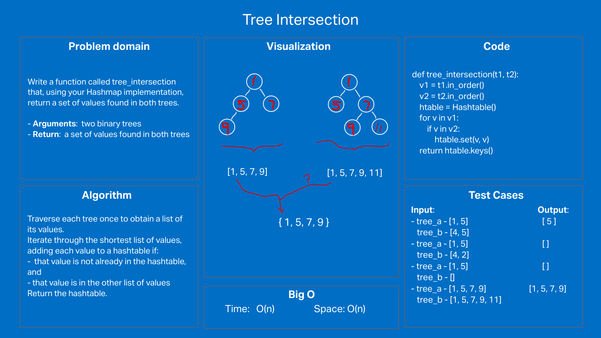

# Challenge Summary

Write a function called tree_intersection that takes two binary trees as parameters.
Using your Hashmap implementation as a part of your algorithm, return a set of values found in both trees.

## Whiteboard Process

## Approach & Efficiency

The Binary Tree class has three similar traversing methods (e.g. in_order) that return a list of the values in the tree.

Traverse each tree once to obtain the list of its values.
Iterate through the shortest list of values, adding each value to a hashtable if:
  that value is not already in the hashtable, and
  that value is in the other list of values
Return the hashtable.

Time and space complexity: O(n)

## Solution

Passes all custome and required unit tests (by successfuly returning a collection of the common elements):

- small():
    tree_a - [1, 5]
    tree_b - [4, 5]
- no_common():
    tree_a - [1, 5]
    tree_b - [4, 2]
- one_empty():
    tree_a - [1, 5]
    tree_b - []
- almost_same():
    tree_a - [1, 5, 7, 9]
    tree_b - [1, 5, 7, 9, 11]
- tree_intersection():
    tree_a - [150, 100, 250, 75, 160, 200, 350, 125, 175, 300, 500]
    tree_b - [42, 100, 100, 15, 160, 200, 350, 125, 175, 4, 500]
