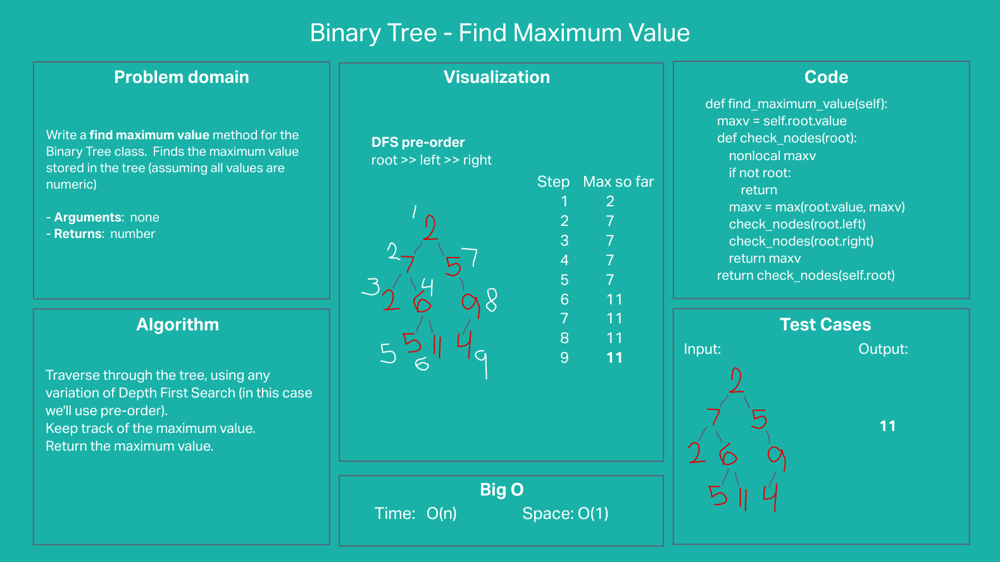

# Stack-queue pseudo

## Problem statement

Write a find maximum value method for the Binary Tree class.  Finds the maximum value stored in the tree (assuming all values are numeric)

- Arguments: none
- Returns: number

## Whiteboard

## Approach & Efficiency
#### Approach
- Traverse through the tree, using a variation of Depth First Search (in this case we'll use pre-order).
- Keep track of the maximum value.
- Return the maximum value.

#### Efficiency: O(N) time and O(1) space

## Solution
The approach passes required and custom tests:
- Two-level tree with a larger positive value and a negative value
- Three-level tree with only negative values

---

[Back to table of contents](../../README.md)
