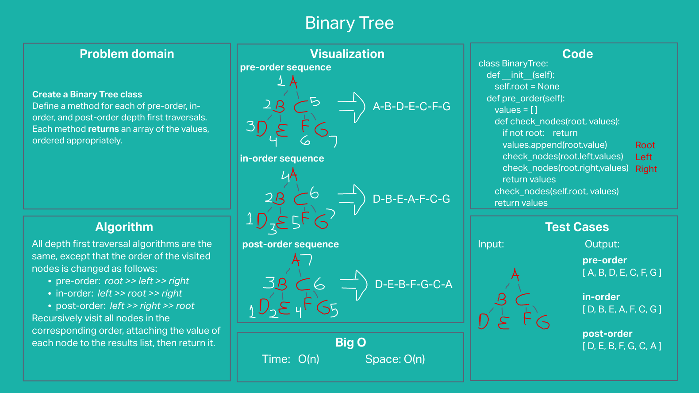
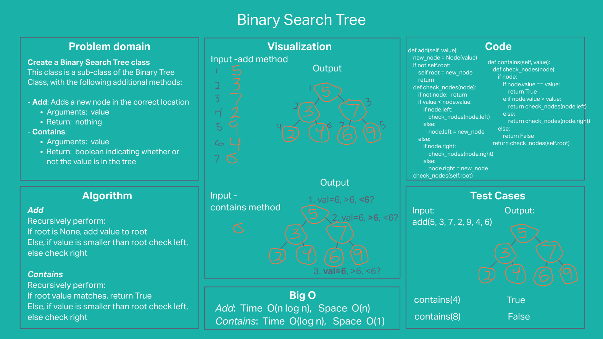

# Challenge Summary

- **Create a Node class** that has properties for the value stored in the node, the left child node, and the right child node.

- **Create a Binary Tree class**
  - Define a method for each of the depth first traversals, each of which **returns** an array of the values, ordered appropriately:
    - pre order
    - in order
    - post order
  - Any exceptions or errors that come from your code should be semantic, capture-able errors. Instead of a default error thrown by your language, your code should raise/throw a custom, semantic error that describes what went wrong.

- **Create a Binary Search Tree class**
  This class should be a sub-class of the Binary Tree Class, with the following additional methods:
  - Add:
    - **Arguments**: value
    - **Return**: nothing
    - Adds a new node with that value in the correct location in the binary search tree
  - Contains:
    - **Arguments**: value
    - **Return**: boolean indicating whether or not the value is in the tree

## Whiteboard Process

## Approach & Efficiency

#### Binary Tree
  - **Algorithm**:  All depth first traversal algorithms are the same, except that the order of the visited nodes is changed as follows:
  - pre-order:  root >> left >> right
  - in-order:  left >> root >> right
  - post-order:  left >> right >> root
  Recursively visit all nodes in the corresponding order, attaching the value of each node to the results list, then return it.
  - **Efficiency**: Time and Space: O(n) -visits all nodes and creates and array containing the value of each node

#### Binary Seatch Tree
  - **Add**:  Recursively perform:
    - if root is None, add value to root
    - else, if value is smaller than root's, check left, otherwise check right
    - **Efficiency**: Time O(log n), Space: O(1)
  - **Contains**: Recursively perform:
    - if root value matches, return True
    - else, if value is smaller than root's, check left, otherwise check right
    - **Efficiency**: Time O(log n), Space: O(1)

## Solution

Can successfully:
- instantiate an empty tree
- instantiate a tree with a single root node
- add a left child and right child properly to a Binary Search Tree
- return a collection from a preorder traversal
- return a collection from an inorder traversal
- return a collection from a postorder traversal
- return true or false for the contains method, given an existing or non-existing node value
