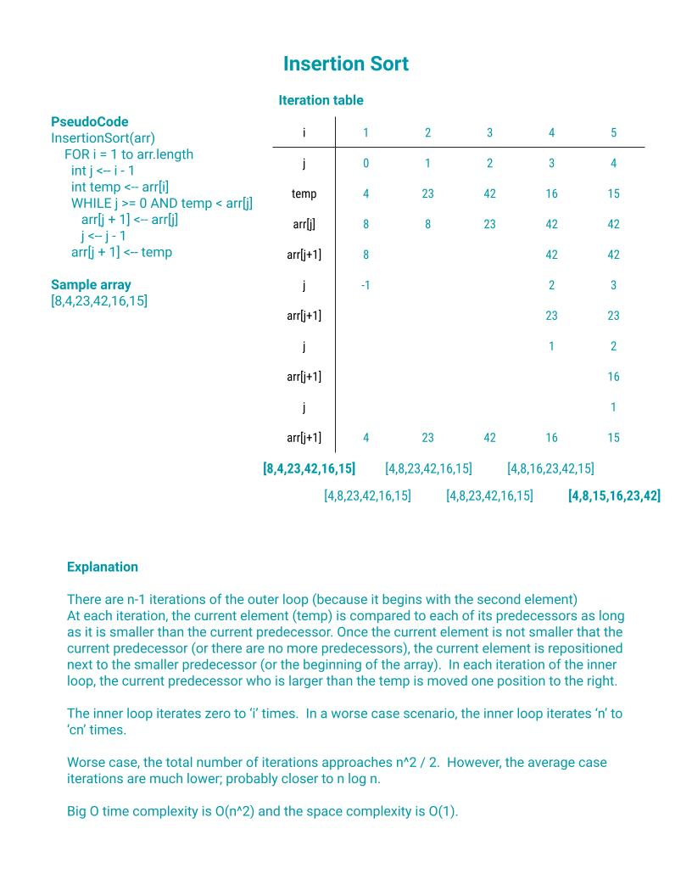

# Challenge Summary

### Insertion Sort
- Provide a visual step through for the sample array `[8,4,23,42,16,15]` based on the provided pseudo code
- Convert the pseudo-code into working code in your language
- Present a complete set of working tests

## Whiteboard Process

## Approach & Efficiency
Insertion sort appears to have a Big O time complexity of O(n^2) and space complexity of O(1).

## Solution
To test run the code, use `pytest -k insertion_sort`

Currently, there are five unit tests (all passed):

- two_values  [20,15]
- sample_array  [8,4,23,42,16,15]
- reverse_sorted  [20,18,12,8,5,-2]
- few uniques  [5,12,7,5,5,7]
- nearly-sorted  [2,3,5,7,13,11]
